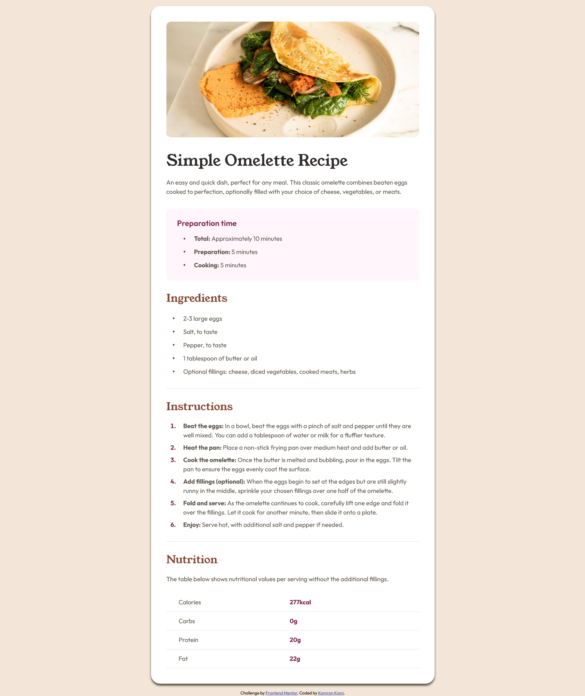

# Frontend Mentor - Recipe page solution

This is a solution to the [Recipe page challenge on Frontend Mentor](https://www.frontendmentor.io/challenges/recipe-page-KiTsR8QQKm).

## Table of contents

- [Frontend Mentor - Recipe page solution](#frontend-mentor---recipe-page-solution)
  - [Table of contents](#table-of-contents)
  - [Overview](#overview)
    - [Screenshot](#screenshot)
    - [Links](#links)
  - [My process](#my-process)
    - [Built with](#built-with)
    - [What I learned](#what-i-learned)
  - [Author](#author)

## Overview

### Screenshot



### Links

- Solution URL: [Github](https://github.com/kaamiik/fm-Recipe-Page)
- Live Site URL: [Vercel](https://fm-recipe-page.vercel.app/)

## My process

### Built with

- Semantic HTML5 markup
- CSS custom properties
- Flexbox
- Mobile-first workflow

### What I learned

I learned a lot from this project. In this project, the structure of HTML is very important and it greatly helps in problem-solving and styling. Also, using a CSS reset is very helpful. One of the main challenges for me in this project was centering the bullets in list items. To solve this problem, I used the following code.

```css
.card__prepration--item--text,
.card__ingredients--item--text {
  display: inline-block;
  vertical-align: middle;
  margin-left: 16px;
}
```

I also used padding to create spaces when writing the CSS codes related to the table.

## Author

- Frontend Mentor - [@kaamiik](https://www.frontendmentor.io/profile/kaamiik)
